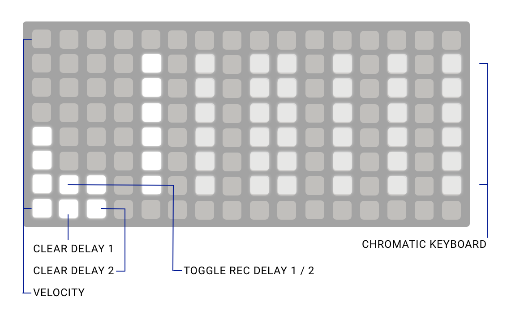

## Autumn

Fall's audio engine presented as a playable synth.

You can plug in a grid or a MIDI keyboard, then set the LFOs to change things as you play.

Features:

* Simple filtered analogue oscillator sound with bit depth
* Attack and decay envelope
* Gain and panning controls
* Two independent delay lines
* Clear each delay line (using the shift key or the grid)
* Three LFOs
* Simple chromatic grid with a way to handle velocity and manage the delays

## Installation

Until this is released in the norns community scripts, open Maiden and run this command:

```
;install https://github.com/ambalek/autumn
```

Remember to restart norns because Autumn uses a custom Supercollider engine.

## Usage

The UI is designed around dials and buttons that reflect the layout of the buttons on norns. Here's an example.


The first dial (encoder 1) is unused on this page. The second dial is used to change the pulsewidth (encoder 2), and the third dial is used to change the bit depth of the sound (encoder 3).

The first button next to encoder 1 (key 1) does nothing, the second button (key 2) goes to the previous page, and the third button (key 3) goes to the next page.

Sometimes key 1 is used as a shift key for secondary dial and button keys. Here's an image showing a screen with a shift button.


Pressing shift changes "prev" (key 2) to "reset" -- this allows you to reset the delay line.

Here's the shift key held down on that view:


The LFO pages actually have a slightly different layout because I couldn't quite fit the LFO with the dials, but I have text hints for what each encoder does. This is what the LFO page looks like:


This is what happens when the shift key is pressed on this screen:


## Grid

The grid is broken down like this:

* First column: velocity for subsequent notes
* Fifth column, skipping the first and last rows: Chromatic keyboard, starting at C, with bright keys for whole notes
* Last row, second and third columns (flashing): Clear short delay and long delay, flashing at the delay rate
* Second to last row, second and third columns (flashing): Stop recording on the short and long delays, again flashing at the delay rate

Here's an image illustrating the grid layout.



## Shouts

* [Peter Bark](https://www.instagram.com/peterbarkmusic/) suggested this script idea (playable Fall) to me on Instagram

## To-do

- [x] Basic UI design
- [x] Delays
- [x] Settings
- [x] Basic LFOs
- [x] Create a way to allow LFOs to modify the params instead of the engine, because dials need to have their state updated as well
- [x] Pressing shift toggles different LFO values
- [x] Finish linking up LFOs to dials -- "l del" and "s del" might need to be renamed
- [x] Add panning as an LFO
- [x] Grid control
- [x] it'd be nice if delay kill applied to the right buffer
- [x] Make the dials update properly when loading settings
- [ ] Key tracking
- [ ] Add delay rec toggle to the main UI
- [ ] Allow delay softcut rate to be changed to get half speed loops
- [ ] Configurable octave range
- [ ] It'd be nice to show numbers when using the dials
- [ ] MIDI config required?
- [ ] MIDI grid?
- [ ] Maybe display the current note somewhere to help people playing on the grid
- [ ] Add controls for delay filters